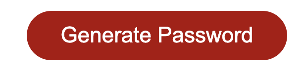

# Password Generator

## Completed by Michael Shaw 
## UWA Coding Bootcamp: Week 3 Homework Assignment

This password generator was created for a homework assignment for UWA's coding bootcamp.

This application makes use of Javascript to generate a random, secure password for the user. 


### Getting Started

This project has been deployed to GitHub Pages. To use this password generator, you can follow the deployment link. Or, download the source files to use this as a template.

* [Deployed GitHub IO](https://michaelshxw.github.io/JavaScript-Password-Generator)
* [GitHub Repository](https://github.com/michaelshxw/JavaScript-Password-Generator)

### Prerequisites
To install this application, a text editor such as Visual Studio Code is required. This can be downloaded [here](https://code.visualstudio.com/download)

### Languages Used
* HTML 
* CSS
* JavaScript

### Installation
To install this code, download the zip file, or use GitHub's guidelines to clone the repository

### Summary
* This password generator uses HTML, CSS and JavaScript to create a random password
* This project highlights the use of JavaScript to make dynamic changes to a HTML document


### Project Features
* A generate button
    * When this button is clicked, a series of prompts and confirms will be displayed to the user
    * After the user has selected their options, a random password will be generated from those selected options



* A text area
    * This is where the users password will be displayed once it has been generated 
    


### Project Requirements 

Below is the acceptance criteria that was given for the homework assignment
```
GIVEN I need a new, secure password
WHEN I click the button to generate a password
THEN I am presented with a series of prompts for password criteria
WHEN prompted for password criteria
THEN I select which criteria to include in the password
WHEN prompted for the length of the password
THEN I choose a length of at least 8 characters and no more than 128 characters
WHEN prompted for character types to include in the password
THEN I choose lowercase, uppercase, numeric, and/or special characters
WHEN I answer each prompt
THEN my input should be validated and at least one character type should be selected
WHEN all prompts are answered
THEN a password is generated that matches the selected criteria
WHEN the password is generated
THEN the password is either displayed in an alert or written to the page
```

### Authors
* **Michael Shaw** (JavaScript) [GitHub Profile](https://github.com/michaelshxw)
* UWA / Trilogy (HTML and CSS)
